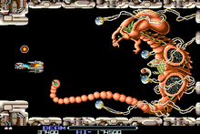
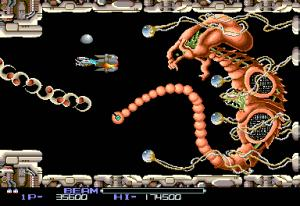

# R-Type

## Table of Contents

1. [Presentation of the project](#presentation-of-the-project)

### Presentation of the project

The purpose of this project is to remake the R-Type game.
For those who don't know this game, it's a shoot them up with horizontal scrolling,
developed by Irem and started in 1987 on arcade terminals.

