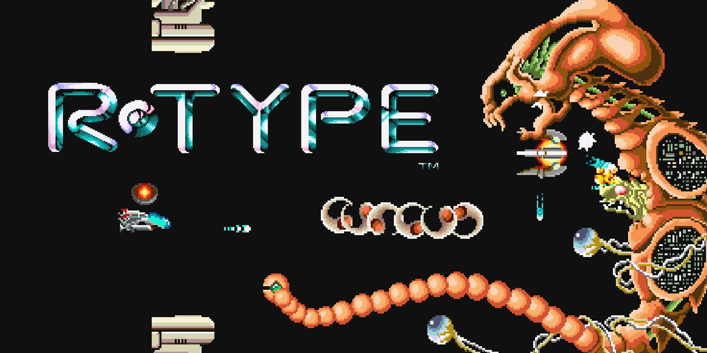

# R-Type
  
### Table of Contents

Launch by using `./make_r-type client`
1. [Presentation of the project](#presentation-of-the-project)
2. [Requirements](#Requirements)
3. [How to run the game](#How-to-run-the-game)
4. [Controls](#controls)
5. [Developers](#Developers)

### Presentation of the project
#
The purpose of this project is to remake the R-Type game, adding a multiplayer element to it.
R-type is a a shoot them up with horizontal scrolling,
developed by Irem and released in 1987 on arcade machines.


In order to make the game multiplayer, we implemented a multithreaded server using [Asio](https://www.boost.org/doc/libs/1_76_0/doc/html/boost_asio.html), from the [Boost](https://www.boost.org) library.

The game is rendered using the [SFML](https://www.sfml-dev.org/) library, and has fully been developped in C++. 

### Requirements
#

    
The project runs on Windows and Unix systems, using [CMake](https://cmake.org/).  
Make sure Boost is already installed on your system, or use their [man page](https://www.boost.org/doc/libs/1_67_0/doc/html/boost_asio/using.html) to install it according to your specs. 
<br/>

### Run the game
#
   
On Linux and mac : 
```sh
$ ./make_client && ./make_server && ./r-type_server && ./r-type_client
```
  
On Windows :
```sh
$ In a future release
```
### Controls
#
 Button        | Direction
 --------------|-------------
 Up Arrow      | Top
 Down Arrow    | Down
 Left Arrow    | Left
 Right Arrow   | Right
 Spacebar      | Shoot


### Developers
#

| [<br><sub>Axel Zenine</sub>](https://github.com/Azzzen) | [<br><sub>Erwan Simonetti</sub>](https://github.com/ErwanSimonetti) | [<br><sub>Martin Blancho</sub>](https://github.com/BlanchoMartin) | [<br><sub>Juliette Destang</sub>](https://github.com/JulietteDestang) | [<br><sub>Timothée De Boynes</sub>](https://github.com/TdeBoynes)
| :---: | :---: | :---: | :---: | :---: |